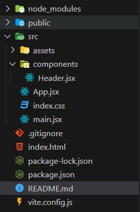
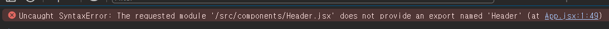

# Issue 1: Header.jsx couldn't be Imported / Exported

### Header jsx 파일이 import, export 되지 않는 상태

- 폴더 구조

  

- App.jsx

  ```jsx
  import { Header } from "./components/Header.jsx";

  function App() {
    return <Header />;
  }

  export default App;
  ```

- Header.jsx

  ```jsx
  import QuizLogoImg from "../assets/quiz-logo.png";

  export default function Header() {
    return (
      <header>
        
        <h1>React Quiz App</h1>
      </header>
    );
  }
  ```

- 브라우저 Console

  

- 해결!

  - App.jsx에서 Header.jsx를 import 할때, Header 컴포넌트가 export default로 모듈화 되었기 떄문에 {} 괄호 감싸기 없이 Header를 호출 했어야 한다.

# Issue 2 : userAnswer State 의 위치

> 강의에서는 userAnswer의 위치를 Quiz.jsx에 작성하여 컨트롤 하였다.
> 나는 강의와는 다르게 해보고 싶은 마음에 App.jsx에 userAnswer State 를 위치시켜 개발을 진행해보았다.

# Issue 3 : QuizTimer Re-Render

> QuizTimer 컴포넌트가, 내부 로직에 따라 타임아웃이 종료된후, userAnswer에 null 값을 추가하여 Re-Rendering이 되어야 하는데, userAnswer에 null은 추가하지만 Re-Render가 되지 않았다.

- 해결

> QuizTimer를 호출하는 Quiz.jsx에서 QuizTimer를 호출할때, key 속성을 주어서 (계속 변하는 Key) userAnswer State가 변화함에 따라 그 길이도 변하는 점을 이용하여 Quiz의 props 중 하나인 selectedAnswerIndex를 key 로 할당하여 해결하였다.

```jsx
export default function Quiz({
  selectAnswer,
  selectedAnswerIndex,
  quizIsComplete,
}) {
  if (quizIsComplete) {
    return (
      <div id="summary">
        
        <h2>Quiz Complete</h2>
      </div>
    );
  }

  // 문제 섞기
  const shuffleAnswers = [...QUESTIONS[selectedAnswerIndex].answers];
  shuffleAnswers.sort(() => Math.random() - 0.5);

  return (
    <div id="quiz">
      <div id="question">
        <QuizTimer
          key={selectedAnswerIndex}
          onTimeout={() => selectAnswer(null)}
          timeout={10 * 1000}
        />
        ;<h2>{QUESTIONS[selectedAnswerIndex].text}</h2>
        <ul id="answers">
          {shuffleAnswers.map((answer, idx) => (
            <li key={idx} className="answer">
              <button onClick={() => selectAnswer(answer)}>{answer}</button>
            </li>
          ))}
        </ul>
      </div>
    </div>
  );
}
```
